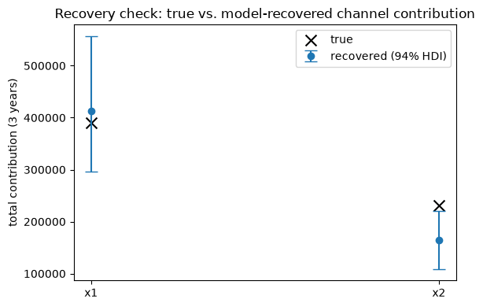
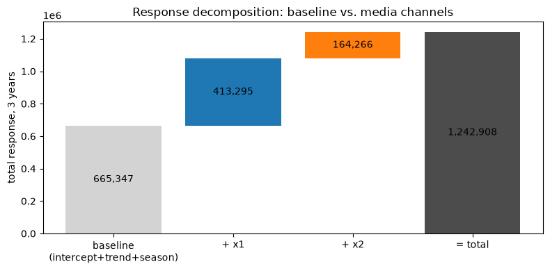
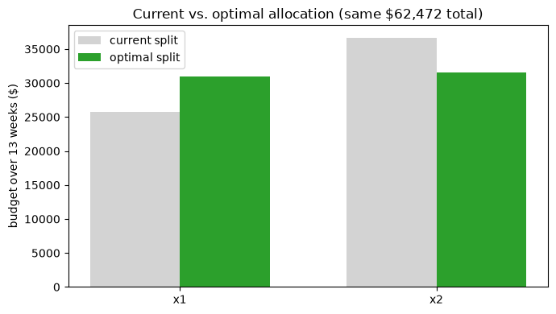
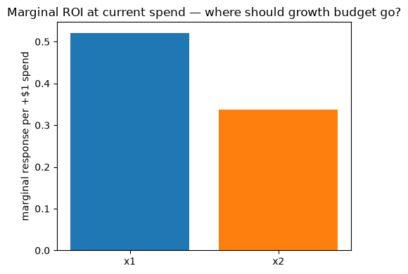

# Marketing Mix Modeling: does the budget split make sense?

A worked MMM case built to demonstrate one specific skill: taking a Bayesian
media-mix model past the "the model fits" stage to an actual budget decision,
with the honesty checks a real client engagement would need.

## Business question

**Given a fixed marketing budget split between two channels, is there a
better split — and how much more response would it buy at the same spend?**

This is the question every growth/marketing lead eventually asks once
click-based attribution stops being trustworthy (iOS 14.5+, cookie
deprecation, walled gardens). MMM answers it from spend and outcome data
alone, no tracking pixels required.

## Method

- **Model:** Bayesian Marketing Mix Model, `pymc-marketing` 0.19.4,
  `multidimensional.MMM` class (the current API — the older `mmm.MMM` is
  deprecated).
- **Mechanics:** *adstock* (spend keeps affecting response for several weeks
  after it happens) and *saturation* (the marginal dollar works less well
  than the first one — every channel has a ceiling).
- **Diagnostics:** convergence (r_hat, ESS, divergences) and, critically, a
  **recovery check** — see below.
- **Optimization:** `BudgetOptimizer`, bounded to the historically-observed
  spend range per channel (more on why below).

## Data

Two tracks, on purpose:

- **Track A** — `pymc-marketing`'s own bundled demo dataset
  (`mmm_example.csv`, 179 weeks, 2 channels). Quick sanity-check that the
  pipeline runs end to end.
- **Track B — synthetic data with known ground truth.** I generated 156
  weeks of spend and response myself, with fixed, known adstock rates,
  saturation curves, and channel contributions. This is **not real client
  data** and isn't presented as one — it exists for one purpose: to prove
  the method recovers a truth we know, before trusting it on a truth we
  don't.

## Result 1: recovery

The model's posterior channel contributions vs. the true (simulated)
contributions, over the full 3-year synthetic history:

| channel | true total | recovered (mean) | error | true value in 94% HDI? |
|---|---|---|---|---|
| x1 | 389,754 | 413,295 | +6.0% | yes |
| x2 | 230,715 | 164,266 | −28.8% | no (~4% outside the upper bound) |



Both fits converged cleanly (r_hat = 1.0, zero divergences on both channels)
— the x2 gap isn't a sampling failure, it's an **identification** problem:
x2 has a stronger carryover rate (adstock 0.6 vs. x1's 0.4), and 156 weekly
observations aren't quite enough to pin down its saturation curve precisely
from spend data alone. That's a real, well-known MMM limitation, not a bug
— in practice it's exactly the kind of channel a lift test gets run on. I'm
reporting it rather than tuning it away because the honest result is more
useful than a suspiciously clean one.

Response decomposition — where the (simulated) 3-year total actually came
from:



## Result 2: the budget number

Setup, chosen deliberately to avoid a common MMM mistake (extrapolating past
the spend range the saturation curve was actually calibrated on):

- Horizon: 13 weeks (one quarter)
- Total budget: 13× the historical average combined weekly spend — the same
  money already being spent, not a hypothetical bigger number
- Per-channel bounds: capped at 13× that channel's historical *maximum*
  weekly spend, so the optimizer can never be asked to price a spend level
  it has never seen

**Headline number:** at the same $62,472 quarterly budget, the
model-optimal split returns **+0.34% more response** than the current
historical split. Modest — because the current split already sits close to
where the two channels' marginal returns roughly balance.



**Second number, and the more useful one for growth budget:** at *today's*
spend levels, the next incremental dollar into x1 returns **1.5x** what it
would in x2 ($0.52 vs. $0.34 marginal response per $1). Reallocating the
existing budget barely moves the needle (both curves are already fairly
flat locally), but if the budget is *growing*, the new money should go to
x1 first.



These two numbers aren't in tension — they answer different questions.
Shuffling this quarter's money won't do much; deciding where next quarter's
*increase* goes is a different, more actionable call, and the model
supports both.

## What I'd do with real client data

- Run the recovery check on Track A's structure first, since real data
  never comes with a ground-truth answer key — recovery on synthetic data
  is the calibration step, not the deliverable.
- Push for at least one lift/incrementality test on whichever channel comes
  back weakly identified (here, x2) rather than trust the model's point
  estimate for it.
- Re-run the budget optimization on a rolling basis as spend history grows
  — the "safe bound" grows with it, and so does the confidence in the
  recommendation.
- Sanity-check the two headline numbers against the media plan's actual
  flexibility — a 0.34% reallocation gain isn't worth relitigating a signed
  media contract; a 1.5x marginal ROI gap is worth acting on for net-new
  budget.

## Limitations (honest, on purpose)

- Track B is synthetic. It proves the method recovers a known truth; it
  does not prove anything about these specific two channels in the real
  world.
- The budget optimizer never proposes spend outside each channel's
  historical range — by design. Extrapolated recommendations from an
  uncalibrated part of the saturation curve are not reliable, and no output
  here should be read as "spend more than we've ever spent per week."
- x2's saturation curve carries real uncertainty (see Result 1). Any
  business decision resting specifically on x2's absolute ceiling should be
  paired with a lift test, not just this model.

## Repo contents

- `notebooks/mmm_case.ipynb` — the full, executed notebook (data → model →
  diagnostics → recovery → visualizations → budget optimization)
- `scripts/build_notebook.py` — generates the notebook from source (used
  during development to keep cell sources under version control cleanly)
- `data/` — bundled demo dataset + generated synthetic dataset and its
  ground truth
- `requirements.txt` — pinned dependencies (also see `pyproject.toml` /
  `uv.lock` for the exact dev environment, built with
  [uv](https://github.com/astral-sh/uv))

```bash
python -m venv .venv && source .venv/bin/activate
pip install -r requirements.txt
jupyter notebook notebooks/mmm_case.ipynb
```
